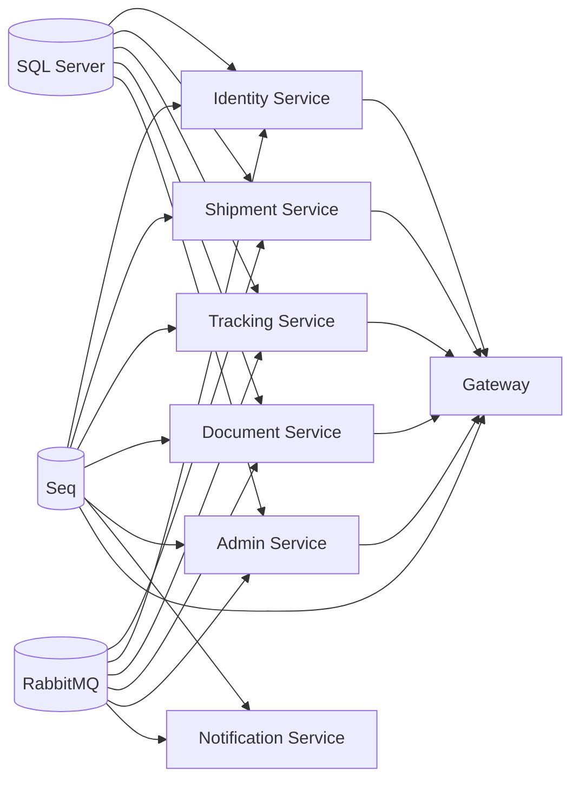

# SmartShip Backend Documentation

**Version:** 2.0  
**Last Updated:** April 4, 2026  
**Scope:** Backend Services Only (Infrastructure & API Layer)

---

## Table of Contents

1. [Executive Summary](#executive-summary)
2. [Tech Stack](#tech-stack)
3. [Architecture Overview](#architecture-overview)
4. [Backend Services](#backend-services)
5. [Project Structure](#project-structure)
6. [Design Patterns & Methodologies](#design-patterns--methodologies)
7. [Event-Driven Architecture & RabbitMQ](#event-driven-architecture--rabbitmq)
8. [API Gateway](#api-gateway)
9. [Data Persistence](#data-persistence)
10. [Service Communication](#service-communication)
11. [Security & Authentication](#security--authentication)
12. [Logging & Observability](#logging--observability)
13. [Deployment Topology](#deployment-topology)

---

## Executive Summary

SmartShip is a **microservices-based logistics platform** built on .NET 10 and ASP.NET Core. It orchestrates shipment booking, lifecycle tracking, document management, and administrative operations through a collection of independently deployable services communicating via REST APIs (through the Gateway) and asynchronous events (via RabbitMQ).

**Core Capabilities:**

- Customer onboarding, authentication (JWT + OAuth2/Google), and role-based authorization
- Shipment lifecycle management: booking → pickup → in-transit → delivery
- Real-time tracking timeline and location updates
- Document uploads and delivery proof handling
- Notification system (email-based event-driven alerts)
- Administrative dashboards and exception management

**Why Microservices?**

- **Domain Separation:** Distinct bounded contexts minimize coupling (Identity, Shipment, Tracking, Documents, Admin, Notifications)
- **Scalability:** Services scale independently based on load
- **Resilience:** Failure in one service doesn't cascade to others
- **Event Choreography:** RabbitMQ-based async communication reduces tight coupling
- **Development Velocity:** Teams can evolve services independently

---

## Tech Stack

### Runtime & Framework

| Component    | Version | Purpose                                                              |
| ------------ | ------- | -------------------------------------------------------------------- |
| .NET         | 10.0    | Runtime framework                                                    |
| ASP.NET Core | 10.0    | Web framework for REST APIs                                          |
| C# 13        | Latest  | Primary language (nullable reference types, implicit usings enabled) |

### Data & Persistence

| Component                       | Version | Purpose                                              |
| ------------------------------- | ------- | ---------------------------------------------------- |
| SQL Server                      | 2022    | Relational database (per-service isolated databases) |
| Entity Framework Core (EF Core) | 10.0.5  | ORM for database access                              |
| EF Migrations                   | —       | SQL schema versioning & evolution                    |

### Message Broker & Events

| Component               | Version       | Purpose                                           |
| ----------------------- | ------------- | ------------------------------------------------- |
| RabbitMQ                | 3.12 (Alpine) | Message broker for event choreography             |
| RabbitMQ.Client         | 6.8.1         | .NET client library for AMQP protocol             |
| Fanout Exchange Pattern | —             | Pub/sub event distribution (all services receive) |

### API & Gateway

| Component              | Version | Purpose                                           |
| ---------------------- | ------- | ------------------------------------------------- |
| Ocelot                 | Latest  | API Gateway (routing, aggregation, rate limiting) |
| Swashbuckle.AspNetCore | 6.6.2   | OpenAPI/Swagger documentation & UI                |

### Authentication & Authorization

| Component                                     | Version | Purpose                           |
| --------------------------------------------- | ------- | --------------------------------- |
| JWT (System.IdentityModel.Tokens.Jwt)         | 8.16.0  | JWT token generation & validation |
| Microsoft.AspNetCore.Authentication.JwtBearer | 10.0.5  | JWT middleware for ASP.NET Core   |
| Google.Apis.Auth                              | 1.69.0  | OAuth2 Google authentication      |

### Logging & Observability

| Component                               | Version | Purpose                                |
| --------------------------------------- | ------- | -------------------------------------- |
| Serilog                                 | 4.3.0   | Structured logging framework           |
| Serilog.AspNetCore                      | 10.0.0  | Serilog integration for ASP.NET Core   |
| Serilog.Sinks.Seq                       | 8.0.0   | Structured log sink to Seq server      |
| Serilog.Sinks.File                      | 7.0.0   | File-based log persistence             |
| Serilog Enrichers (Environment, Thread) | Latest  | Context enrichment for logs            |
| Seq                                     | 2024.3  | Centralized structured log UI & search |

### SMTP & Notifications

| Component       | Purpose                                            |
| --------------- | -------------------------------------------------- |
| System.Net.Mail | Native .NET SMTP client                            |
| Gmail SMTP      | External email provider (configured in production) |

### Dependency Injection & Configuration

| Component                                | Purpose                                                        |
| ---------------------------------------- | -------------------------------------------------------------- |
| Microsoft.Extensions.DependencyInjection | Built-in DI container                                          |
| Microsoft.Extensions.Configuration       | Configuration management (appsettings.json, ENV vars, secrets) |
| User Secrets                             | Local development secrets (not committed to version control)   |

### Testing & Quality

| Component      | Purpose                                 |
| -------------- | --------------------------------------- |
| xUnit / MSTest | Unit testing framework (if tests exist) |
| Moq            | Mocking library for unit tests          |

---

## Architecture Overview

### System Context Diagram (C4 Model - Level 1)

```
External Actors:
  - Customer (web/mobile user)
  - Admin (internal staff)
  - Operations Agent (fulfillment team)
  - Driver (delivery partner)

┌─────────────────────────────────────────────────┐
│         SmartShip Platform                       │
│  ┌──────────────────────────────────────────┐   │
│  │      API Gateway (Ocelot)                │   │
│  │  ├─ Route forwarding                     │   │
│  │  ├─ JWT validation                       │   │
│  │  ├─ Rate limiting                        │   │
│  │  └─ Swagger aggregation                  │   │
│  └──────────────────────────────────────────┘   │
│           ↓↓↓                                     │
│  ┌────────┴────────────────────────────────┐    │
│  │                                          │    │
│  │ ┌──────────────────────────────────┐   │    │
│  │ │ Identity Service                 │   │    │
│  │ ├─ Auth (JWT, refresh tokens)      │   │    │
│  │ ├─ OAuth2 (Google)                 │   │    │
│  │ ├─ Users & Roles                   │   │    │
│  │ └─ Internal Contact API            │   │    │
│  │ └──────────────────────────────────┘   │    │
│  │                                          │    │
│  │ ┌──────────────────────────────────┐   │    │
│  │ │ Shipment Service                 │   │    │
│  │ ├─ CRUD operations                 │   │    │
│  │ ├─ Package management              │   │    │
│  │ ├─ Status transitions              │   │    │
│  │ └─ Event publisher                 │   │    │
│  │ └──────────────────────────────────┘   │    │
│  │                                          │    │
│  │ ┌──────────────────────────────────┐   │    │
│  │ │ Tracking Service                 │   │    │
│  │ ├─ Timeline events                 │   │    │
│  │ ├─ Location updates                │   │    │
│  │ ├─ Status views                    │   │    │
│  │ └─ Event consumer                  │   │    │
│  │ └──────────────────────────────────┘   │    │
│  │                                          │    │
│  │ ┌──────────────────────────────────┐   │    │
│  │ │ Document Service                 │   │    │
│  │ ├─ File operations                 │   │    │
│  │ ├─ Metadata management             │   │    │
│  │ ├─ Delivery proof                  │   │    │
│  │ └─ Event consumer                  │   │    │
│  │ └──────────────────────────────────┘   │    │
│  │                                          │    │
│  │ ┌──────────────────────────────────┐   │    │
│  │ │ Admin Service                    │   │    │
│  │ ├─ Hubs & locations                │   │    │
│  │ ├─ Dashboards & reports            │   │    │
│  │ ├─ Exception escalation            │   │    │
│  │ └─ Event consumer                  │   │    │
│  │ └──────────────────────────────────┘   │    │
│  │                                          │    │
│  │ ┌──────────────────────────────────┐   │    │
│  │ │ Notification Service (Worker)    │   │    │
│  │ ├─ Event consumption               │   │    │
│  │ ├─ Email templating & sending      │   │    │
│  │ ├─ SMTP integration                │   │    │
│  │ └─ Retry logic                     │   │    │
│  │ └──────────────────────────────────┘   │    │
│  │                                          │    │
│  └──────────────────────────────────────────┘   │
│                                                   │
│  Shared Infrastructure:                          │
│  ├─ SQL Server (databases)                      │
│  ├─ RabbitMQ (event broker)                     │
│  ├─ Seq (log aggregation)                       │
│  └─ SMTP (email provider)                       │
└─────────────────────────────────────────────────┘
```

### High-Level Architecture (C4 Model - Level 2: Container View)

**Sync Communication Path (REST via Gateway):**

```
Client Request
    ↓
API Gateway (Route resolution, JWT validation)
    ↓
Target Microservice (process request)
    ↓
Response (JSON)
```

**Async Communication Path (Events via RabbitMQ):**

```
Service A (publishes event to RabbitMQ Fanout Exchange)
    ↓
RabbitMQ (fans out to all bound queues)
    ↓ ↓ ↓
Service B, C, D (each consumes independently, concurrent)
    ↓ ↓ ↓
Process event → Update DB → Emit side-effect events
```

---

## Backend Services

### 1. SmartShip.Gateway (API Gateway)

**Role:** Single entry point for all frontend requests. Routes requests to appropriate microservices.

**Responsibilities:**

- **Route Forwarding:** Maps `/api/identity/*` → Identity Service, `/api/shipment/*` → Shipment Service, etc.
- **Cross-Cutting Policies:**
  - JWT token validation (bearer token extraction)
  - Rate limiting to prevent abuse
  - Request/response correlation IDs for tracing
  - CORS policy enforcement
- **Swagger Aggregation:** Combines Swagger docs from all services into single UI
- **Service Discovery & Load Balancing:** Directs requests to healthy service instances
- **Caching:** Optional response caching for read-heavy endpoints

**Technology:**

- Framework: ASP.NET Core 10 with Ocelot middleware
- Configuration: `ocelot.json` (route definitions)

**Key Files:**

- [SmartShip.Logistics/SmartShip.Gateway/Program.cs](SmartShip.Logistics/SmartShip.Gateway/Program.cs)
- [SmartShip.Logistics/SmartShip.Gateway/ocelot.json](SmartShip.Logistics/SmartShip.Gateway/ocelot.json)

**Exposed Endpoints:**

- Base URL: `http://localhost:5000/api`
- Example: `GET /api/identity/auth/profile` → routes to IdentityService
- Swagger UI: `http://localhost:5000/swagger`

---

### 2. SmartShip.IdentityService (Authentication & User Management)

**Role:** Manages user authentication, authorization, and role-based access control.

**Responsibilities:**

- **Authentication:**
  - JWT token generation (short-lived access tokens, long-lived refresh tokens)
  - Token refresh mechanism
  - Password-based login (with email/password)
  - OTP validation (if applicable)
- **OAuth2/Social Auth:**
  - Google OAuth2 integration (ID token validation, user auto-creation)
- **User Management:**
  - User registration & profile updates
  - Role assignment (Customer, Admin, Driver, etc.)
  - User deactivation/deletion
- **Internal APIs (Service-to-Service):**
  - Customer contact lookup for notifications
  - Role/permission verification for other services
- **Event Publishing:**
  - `UserCreatedEvent` (triggers welcome email)
  - `UserUpdatedEvent`
  - `UserDeletedEvent`

**Database:**

- SmartShipIdentityDB (SQL Server)
- Key tables: Users, Roles, UserRoles, RefreshTokens, Claims

**Technology:**

- Framework: ASP.NET Core 10
- Authentication: JWT Bearer tokens (System.IdentityModel.Tokens.Jwt)
- OAuth: Google.Apis.Auth
- Database: EF Core + SQL Server

**Key Files:**

- [SmartShip.Logistics/SmartShip.IdentityService/Services/AuthService.cs](SmartShip.Logistics/SmartShip.IdentityService/Services/AuthService.cs)
- [SmartShip.Logistics/SmartShip.IdentityService/Controllers/AuthController.cs](SmartShip.Logistics/SmartShip.IdentityService/Controllers/AuthController.cs)
- [SmartShip.Logistics/SmartShip.IdentityService/Data/IdentityDbContext.cs](SmartShip.Logistics/SmartShip.IdentityService/Data/IdentityDbContext.cs)

**Exposed Endpoints:**

- `POST /auth/signup` - Register new user (password)
- `POST /auth/google-signup` - Register/login via Google
- `POST /auth/login` - Login (email + password)
- `POST /auth/refresh` - Refresh access token
- `POST /auth/logout` - Invalidate refresh token
- `GET /auth/profile` - Get current user profile
- `PUT /auth/profile` - Update profile
- `GET /users` - List users (admin only)
- `POST /users` - Create user (admin)
- `GET /users/{id}` - Get user details
- `PUT /users/{id}` - Update user
- `DELETE /users/{id}` - Delete user
- `POST /users/{id}/resend-welcome` - Resend welcome email

---

### 3. SmartShip.ShipmentService (Shipment Lifecycle)

**Role:** Manages shipment booking, updates, and status transitions.

**Responsibilities:**

- **Shipment CRUD:**
  - Create new shipment (booking)
  - Retrieve shipment details
  - List shipments (with filters: status, date range, customer)
  - Update shipment metadata
- **Package Management:**
  - Add/remove packages to shipment
  - Package tracking (weight, dimensions, contents)
- **Status Transitions:**
  - Pending → Booked → Picked Up → In Transit → Out for Delivery → Delivered
  - Validate state machine (only valid transitions allowed)
- **Event Publishing:**
  - `ShipmentCreatedEvent`
  - `ShipmentBookedEvent`
  - `ShipmentPickedUpEvent`
  - `ShipmentInTransitEvent`
  - `ShipmentOutForDeliveryEvent`
  - `ShipmentDeliveredEvent`
  - `ShipmentExceptionEvent` (for failures/damages)

**Database:**

- SmartShipShipmentDB (SQL Server)
- Key tables: Shipments, Packages, ShipmentStatus, ShipmentPricing

**Technology:**

- Framework: ASP.NET Core 10
- Database: EF Core + SQL Server
- Messaging: RabbitMQ (publisher)

**Key Files:**

- [SmartShip.Logistics/SmartShip.ShipmentService/Services/ShipmentService.cs](SmartShip.Logistics/SmartShip.ShipmentService/Services/ShipmentService.cs)
- [SmartShip.Logistics/SmartShip.ShipmentService/Controllers/ShipmentController.cs](SmartShip.Logistics/SmartShip.ShipmentService/Controllers/ShipmentController.cs)
- [SmartShip.Logistics/SmartShip.ShipmentService/Data/ShipmentDbContext.cs](SmartShip.Logistics/SmartShip.ShipmentService/Data/ShipmentDbContext.cs)

**Exposed Endpoints:**

- `POST /shipment` - Create new shipment
- `GET /shipment` - List shipments
- `GET /shipment/{id}` - Get shipment details
- `PUT /shipment/{id}` - Update shipment
- `DELETE /shipment/{id}` - Delete shipment
- `POST /shipment/{id}/pickup` - Mark as picked up
- `POST /shipment/{id}/intransit` - Mark as in transit
- `POST /shipment/{id}/outfordelivery` - Mark out for delivery
- `POST /shipment/{id}/delivered` - Mark as delivered
- `POST /shipment/{id}/package` - Add package
- `DELETE /shipment/{id}/package/{packageId}` - Remove package

---

### 4. SmartShip.TrackingService (Tracking Timeline)

**Role:** Records and exposes tracking events for customer visibility.

**Responsibilities:**

- **Timeline Management:**
  - Create tracking entry when shipment is created
  - Append events to timeline (booked, picked up, in transit, delivered, etc.)
  - Maintain chronological history with timestamps
- **Event Consumption:**
  - Listens to shipment lifecycle events from RabbitMQ
  - Automatically updates tracking timeline
  - Handles location updates
- **Data Exposure:**
  - Provide tracking API for customers to view shipment journey
  - Return timeline with all intermediate events and statuses

**Database:**

- SmartShipTrackingDB (SQL Server)
- Key tables: TrackingRecords, TrackingEvents, TrackingLocations

**Technology:**

- Framework: ASP.NET Core 10
- Database: EF Core + SQL Server
- Messaging: RabbitMQ (consumer via background service)

**Key Files:**

- [SmartShip.Logistics/SmartShip.TrackingService/Services/TrackingService.cs](SmartShip.Logistics/SmartShip.TrackingService/Services/TrackingService.cs)
- [SmartShip.Logistics/SmartShip.TrackingService/Controllers/TrackingController.cs](SmartShip.Logistics/SmartShip.TrackingService/Controllers/TrackingController.cs)
- [SmartShip.Logistics/SmartShip.TrackingService/BackgroundServices/TrackingEventsConsumerService.cs](SmartShip.Logistics/SmartShip.TrackingService/BackgroundServices/TrackingEventsConsumerService.cs)

**Exposed Endpoints:**

- `GET /tracking/{shipmentId}` - Get full tracking timeline
- `GET /tracking/{shipmentId}/current` - Get current status
- `GET /tracking/{shipmentId}/events` - Get event list
- `POST /tracking/{shipmentId}/location` - Update location (admin/driver)

---

### 5. SmartShip.DocumentService (Document Management)

**Role:** Manages document uploads, storage, and lifecycle tied to shipments.

**Responsibilities:**

- **File Operations:**
  - Upload documents (invoices, shipping labels, proof of delivery)
  - Download documents
  - Delete documents
- **Metadata:**
  - Track document type, associated shipment, upload timestamp
  - Associate delivery proof with shipment completion
- **Event Consumption:**
  - Listens to shipment events (auto-generate initial label docs)
  - Creates delivery proof record when shipment delivered
- **Storage Backend:**
  - Local filesystem (dev) or cloud storage (S3/Azure Blob in production)

**Database:**

- SmartShipDocumentDB (SQL Server)
- Key tables: Documents, DocumentTypes, DeliveryProofs

**Technology:**

- Framework: ASP.NET Core 10
- File Storage: Local filesystem (abstracted via IFileStorageService)
- Database: EF Core + SQL Server
- Messaging: RabbitMQ (consumer)

**Key Files:**

- [SmartShip.Logistics/SmartShip.DocumentService/Services/DocumentService.cs](SmartShip.Logistics/SmartShip.DocumentService/Services/DocumentService.cs)
- [SmartShip.Logistics/SmartShip.DocumentService/Controllers/DocumentController.cs](SmartShip.Logistics/SmartShip.DocumentService/Controllers/DocumentController.cs)
- [SmartShip.Logistics/SmartShip.DocumentService/Storage/FileStorageService.cs](SmartShip.Logistics/SmartShip.DocumentService/Storage/FileStorageService.cs)
- [SmartShip.Logistics/SmartShip.DocumentService/BackgroundServices/DocumentEventsConsumerService.cs](SmartShip.Logistics/SmartShip.DocumentService/BackgroundServices/DocumentEventsConsumerService.cs)

**Exposed Endpoints:**

- `POST /document/upload` - Upload document
- `GET /document/{documentId}` - Download document
- `DELETE /document/{documentId}` - Delete document
- `GET /document/shipment/{shipmentId}` - List documents for shipment
- `POST /document/{shipmentId}/upload-proof` - Upload delivery proof

---

### 6. SmartShip.AdminService (Administration & Operations)

**Role:** Provides admin/ops staff with dashboards, reports, and shipment management tools.

**Responsibilities:**

- **Master Data:**
  - Hub/location management (create, update, list)
  - Warehouse locations for pickup/delivery
- **Dashboards & Reports:**
  - Shipment summary statistics (total, completed, pending)
  - Daily/weekly delivery metrics
  - Revenue/cost tracking
- **Exception Management:**
  - Escalate failed deliveries
  - Assign exceptions to operations team
  - Manual shipment actions (reroute, reassign, cancel)
- **Event Consumption:**
  - Listens to shipment exception events
  - Auto-escalates if SLA breached

**Database:**

- SmartShipAdminDB (SQL Server)
- Key tables: Hubs, AdminDashboards, ExceptionCases, AdminActions

**Technology:**

- Framework: ASP.NET Core 10
- Database: EF Core + SQL Server
- Messaging: RabbitMQ (consumer)
- Direct Service Integration: Calls ShipmentService via HTTP for actions

**Key Files:**

- [SmartShip.Logistics/SmartShip.AdminService/Services/AdminService.cs](SmartShip.Logistics/SmartShip.AdminService/Services/AdminService.cs)
- [SmartShip.Logistics/SmartShip.AdminService/Controllers/AdminController.cs](SmartShip.Logistics/SmartShip.AdminService/Controllers/AdminController.cs)
- [SmartShip.Logistics/SmartShip.AdminService/BackgroundServices/AdminEventsConsumerService.cs](SmartShip.Logistics/SmartShip.AdminService/BackgroundServices/AdminEventsConsumerService.cs)

**Exposed Endpoints:**

- `GET /admin/dashboard` - Get dashboard summary
- `GET /admin/hubs` - List all hubs
- `POST /admin/hubs` - Create hub
- `PUT /admin/hubs/{id}` - Update hub
- `DELETE /admin/hubs/{id}` - Delete hub
- `GET /admin/exceptions` - List exceptions
- `POST /admin/exceptions/{shipmentId}/escalate` - Escalate exception
- `GET /admin/reports/daily` - Daily delivery report
- `GET /admin/reports/weekly` - Weekly metrics

---

### 7. SmartShip.NotificationService (Event-Driven Email Notifications)

**Role:** Worker service that consumes domain events and sends email notifications.

**Responsibilities:**

- **Event Consumption:**
  - Listens to queues: `user-created-queue`, `shipment-created-queue`, `shipment-outfordelivery-queue`, `shipment-delivered-queue`, `shipment-exception-queue`
- **Recipient Resolution:**
  - Extract email from event payload (user creation, shipment status)
  - Call Identity Service internal API for customer contacts
  - Look up admin emails from configuration
- **Email Notification Types:**
  - **User Created:** Welcome email to new user
  - **Shipment Created:** Notification to admin + customer
  - **Out for Delivery:** Customer notification
  - **Delivered:** Customer notification
  - **Exception Escalated:** Admin notification
- **SMTP Integration:**
  - Send emails via Gmail SMTP (configurable)
  - Retry logic for transient failures
  - Template-based email formatting

**Technology:**

- Framework: ASP.NET Core 10 (Worker Service, no HTTP endpoints)
- Email: System.Net.Mail + SMTP provider
- Messaging: RabbitMQ (consumer)
- Logging: Serilog

**Key Files:**

- [SmartShip.Logistics/SmartShip.NotificationService/Program.cs](SmartShip.Logistics/SmartShip.NotificationService/Program.cs)
- [SmartShip.Logistics/SmartShip.NotificationService/BackgroundServices/NotificationEventsConsumerService.cs](SmartShip.Logistics/SmartShip.NotificationService/BackgroundServices/NotificationEventsConsumerService.cs)
- [SmartShip.Logistics/SmartShip.NotificationService/Services/SmtpEmailNotificationService.cs](SmartShip.Logistics/SmartShip.NotificationService/Services/SmtpEmailNotificationService.cs)

**Configuration (docker-compose.env):**

```
SMTP_HOST=smtp.gmail.com
SMTP_PORT=587
SMTP_USERNAME=<email>
SMTP_PASSWORD=<app-password>
SMTP_FROM_EMAIL=<from@smartship.com>
NOTIFICATION_ADMIN_EMAILS=admin1@smartship.com,admin2@smartship.com
INTERNAL_SERVICE_API_KEY=<secret-key>
```

**Note:** No exposed HTTP endpoints. Runs as background worker consuming RabbitMQ messages.

---

### 8. SmartShip.EventBus (Shared Event Infrastructure Library)

**Role:** Provides reusable event abstractions, contracts, and RabbitMQ utilities.

**Contents:**

- **Abstractions:**
  - `IEventPublisher` - Publish events to RabbitMQ
  - `IEventConsumer` - Consume events from RabbitMQ
- **Implementations:**
  - `RabbitMQPublisher` - Fanout exchange-based event distribution
  - `RabbitMQConsumer` - Per-service queue consumption with retry logic
- **Contracts (Event Definitions):**
  - `UserEvents.cs` (UserCreatedEvent, UserUpdatedEvent, etc.)
  - `ShipmentEvents.cs` (ShipmentCreatedEvent, ShipmentDeliveredEvent, etc.)
  - `DocumentEvents.cs` (if applicable)
- **Constants:**
  - `RabbitMqQueues.cs` - Queue name definitions (centralized)
  - `RabbitMqExchanges.cs` - Exchange names
- **Configuration:**
  - RabbitMQ connection settings (hostname, port, credentials, virtual host)
  - Retry policies (exponential backoff, max attempts)
  - Serialization options (JSON settings)

**Technology:**

- Framework: .NET Class Library (.NET 10)
- Messaging: RabbitMQ.Client (6.8.1)
- Serialization: System.Text.Json

**Key Files:**

- [SmartShip.Logistics/SmartShip.EventBus/Abstractions/IEventPublisher.cs](SmartShip.Logistics/SmartShip.EventBus/Abstractions/IEventPublisher.cs)
- [SmartShip.Logistics/SmartShip.EventBus/Abstractions/IEventConsumer.cs](SmartShip.Logistics/SmartShip.EventBus/Abstractions/IEventConsumer.cs)
- [SmartShip.Logistics/SmartShip.EventBus/Infrastructure/RabbitMQPublisher.cs](SmartShip.Logistics/SmartShip.EventBus/Infrastructure/RabbitMQPublisher.cs)
- [SmartShip.Logistics/SmartShip.EventBus/Infrastructure/RabbitMQConsumer.cs](SmartShip.Logistics/SmartShip.EventBus/Infrastructure/RabbitMQConsumer.cs)
- [SmartShip.Logistics/SmartShip.Shared.Common/EventBus/Contracts/\*.cs](SmartShip.Logistics/SmartShip.Shared.Common/EventBus/Contracts/)
- [SmartShip.Logistics/SmartShip.Shared.Common/EventBus/Constants/RabbitMqQueues.cs](SmartShip.Logistics/SmartShip.Shared.Common/EventBus/Constants/RabbitMqQueues.cs)

---

### 9. SmartShip.Shared.Common & SmartShip.Shared.DTOs (Shared Libraries)

**Role:** Provide common utilities, DTOs, and helpers used across all services.

**SmartShip.Shared.Common:**

- **JWT/Claims Helpers:**
  - Extract user ID, role, email from JWT claims
  - ClaimsPrincipal extensions
- **Response Helpers:**
  - StandardApiResponse<T> wrapper
  - Error response formatting
  - Status code mappings
- **Exceptions:**
  - Custom exception types (NotFoundException, ValidationException, etc.)
  - Global exception handling middleware extensions
- **Constants & Enums:**
  - Role definitions (Customer, Admin, Driver)
  - Shipment statuses
  - Document types
- **Event Contracts & Queue Names** (shared with EventBus)

**SmartShip.Shared.DTOs:**

- **Data Transfer Objects:**
  - UserDTO, ShipmentDTO, TrackingDTO, DocumentDTO
  - Request/Response models for all APIs
  - Reduces coupling between services

**Technology:**

- Framework: .NET Class Library
- No external dependencies (minimal)

---

## Project Structure

```
SmartShip.Logistics/
│
├── SmartShip.Gateway/
│   ├── Program.cs                      # Ocelot configuration & startup
│   ├── ocelot.json                     # Route definitions
│   ├── Controllers/
│   ├── Middleware/
│   └── appsettings.json
│
├── SmartShip.IdentityService/
│   ├── Program.cs
│   ├── Controllers/
│   │   └── AuthController.cs           # /auth/* endpoints
│   ├── Services/
│   │   ├── AuthService.cs              # Core auth logic
│   │   ├── IAuthService.cs
│   │   ├── TokenService.cs             # JWT generation
│   │   └── RoleService.cs              # Role/permission logic
│   ├── Data/
│   │   ├── IdentityDbContext.cs        # EF Core DbContext
│   │   └── Migrations/                 # SQL schema versions
│   ├── Models/
│   │   ├── User.cs
│   │   ├── Role.cs
│   │   └── RefreshToken.cs
│   ├── Repositories/
│   │   ├── UserRepository.cs
│   │   └── RoleRepository.cs
│   ├── Extensions/
│   │   ├── ServiceCollectionExtensions.cs
│   │   └── ClaimsExtensions.cs
│   └── appsettings.json
│
├── SmartShip.ShipmentService/
│   ├── Program.cs
│   ├── Controllers/
│   │   └── ShipmentController.cs
│   ├── Services/
│   │   ├── ShipmentService.cs          # Core business logic
│   │   ├── IShipmentService.cs
│   │   └── PricingService.cs           # Pricing calculation
│   ├── Data/
│   │   ├── ShipmentDbContext.cs
│   │   └── Migrations/
│   ├── Models/
│   │   ├── Shipment.cs
│   │   ├── Package.cs
│   │   └── ShipmentStatus.cs (enum)
│   ├── Repositories/
│   │   └── ShipmentRepository.cs
│   ├── BackgroundServices/
│   │   └── (future event consumer)
│   └── appsettings.json
│
├── SmartShip.TrackingService/
│   ├── Program.cs
│   ├── Controllers/
│   │   └── TrackingController.cs
│   ├── Services/
│   │   ├── TrackingService.cs
│   │   └── ITrackingService.cs
│   ├── Data/
│   │   ├── TrackingDbContext.cs
│   │   └── Migrations/
│   ├── Models/
│   │   ├── TrackingRecord.cs
│   │   └── TrackingEvent.cs
│   ├── Repositories/
│   │   └── TrackingRepository.cs
│   ├── BackgroundServices/
│   │   └── TrackingEventsConsumerService.cs  # Consumes shipment events
│   └── appsettings.json
│
├── SmartShip.DocumentService/
│   ├── Program.cs
│   ├── Controllers/
│   │   └── DocumentController.cs
│   ├── Services/
│   │   ├── DocumentService.cs
│   │   └── IDocumentService.cs
│   ├── Storage/
│   │   ├── IFileStorageService.cs       # Abstraction
│   │   └── LocalFileStorageService.cs   # Implementation
│   ├── Data/
│   │   ├── DocumentDbContext.cs
│   │   └── Migrations/
│   ├── Models/
│   │   ├── Document.cs
│   │   └── DocumentType.cs (enum)
│   ├── Repositories/
│   │   └── DocumentRepository.cs
│   ├── BackgroundServices/
│   │   └── DocumentEventsConsumerService.cs
│   └── appsettings.json
│
├── SmartShip.AdminService/
│   ├── Program.cs
│   ├── Controllers/
│   │   └── AdminController.cs
│   ├── Services/
│   │   ├── AdminService.cs
│   │   ├── IAdminService.cs
│   │   └── DashboardService.cs          # Metrics & reporting
│   ├── Data/
│   │   ├── AdminDbContext.cs
│   │   └── Migrations/
│   ├── Models/
│   │   ├── Hub.cs
│   │   ├── ExceptionCase.cs
│   │   └── DashboardMetric.cs
│   ├── Repositories/
│   │   └── AdminRepository.cs
│   ├── BackgroundServices/
│   │   └── AdminEventsConsumerService.cs
│   ├── Integration/
│   │   └── ShipmentServiceClient.cs     # Direct service calls
│   └── appsettings.json
│
├── SmartShip.NotificationService/
│   ├── Program.cs                      # Worker service setup
│   ├── Services/
│   │   ├── SmtpEmailNotificationService.cs  # Email sender
│   │   └── IEmailNotificationService.cs
│   ├── BackgroundServices/
│   │   └── NotificationEventsConsumerService.cs  # Main event loop
│   ├── Integration/
│   │   └── IdentityContactClient.cs    # Call Identity internal API
│   ├── Templates/
│   │   ├── WelcomeEmailTemplate.html
│   │   ├── ShipmentCreatedTemplate.html
│   │   └── DeliveryNotificationTemplate.html
│   └── appsettings.json
│
├── SmartShip.EventBus/
│   ├── SmartShip.EventBus.csproj
│   ├── Abstractions/
│   │   ├── IEventPublisher.cs
│   │   └── IEventConsumer.cs
│   ├── Infrastructure/
│   │   ├── RabbitMQPublisher.cs
│   │   ├── RabbitMQConsumer.cs
│   │   ├── RabbitMQConnection.cs
│   │   └── RabbitMQConfiguration.cs
│   └── Extensions/
│       └── RabbitMQExtensions.cs        # DI registration
│
├── SmartShip.Shared.Common/
│   ├── Helpers/
│   │   ├── ClaimsExtensions.cs
│   │   ├── ResponseHelpers.cs
│   │   └── ValidationHelpers.cs
│   ├── Exceptions/
│   │   ├── NotFoundException.cs
│   │   ├── ValidationException.cs
│   │   └── ServiceException.cs
│   ├── EventBus/
│   │   ├── Contracts/
│   │   │   ├── UserEvents.cs
│   │   │   ├── ShipmentEvents.cs
│   │   │   └── EventBase.cs (abstract)
│   │   ├── Constants/
│   │   │   ├── RabbitMqQueues.cs
│   │   │   └── RabbitMqExchanges.cs
│   │   └── Enums/
│   │       ├── UserRole.cs
│   │       ├── ShipmentStatus.cs
│   │       └── DocumentType.cs
│   └── Middleware/
│       ├── ExceptionHandlingMiddleware.cs
│       └── CorrelationIdMiddleware.cs
│
├── SmartShip.Shared.DTOs/
│   ├── Request/
│   │   ├── CreateShipmentRequest.cs
│   │   ├── CreateUserRequest.cs
│   │   └── UploadDocumentRequest.cs
│   ├── Response/
│   │   ├── ShipmentResponse.cs
│   │   ├── UserResponse.cs
│   │   ├── TrackingResponse.cs
│   │   └── StandardApiResponse.cs
│   └── Models/
│       ├── ShipmentDTO.cs
│       ├── UserDTO.cs
│       └── TrackingDTO.cs
│
├── SmartShip.Logistics.slnx            # Solution file
│
└── tests/                               # Unit/Integration tests (optional)
    ├── SmartShip.UnitTests/
    ├── SmartShip.IntegrationTests/
    └── SmartShip.E2ETests/

Shared Infrastructure (docker-compose):
├── SQL Server (port 1433)               # Databases
├── RabbitMQ (port 5672 → 5673)          # Message broker
└── Seq (port 5341)                      # Log aggregation
```

---

## Design Patterns & Methodologies

### 1. Microservices Architecture Pattern

**Definition:** Application decomposed into small, independently deployable services.

**Applied in SmartShip:**

- Each service owns its database (database per service principle)
- Services communicate via APIs (Gateway) and events (RabbitMQ)
- Minimal coupling between services
- Each team can evolve services independently

**Benefits:**

- Scalability: Services scale independently
- Fault isolation: Failure in one service doesn't cascade
- Technology flexibility: Services can use different tech stacks (future)

---

### 2. Choreography-Based Event-Driven Architecture

**Definition:** Services communicate asynchronously through events published to a message broker. No central orchestrator.

**Applied in SmartShip:**

- **Publishers:** Identity Service, Shipment Service publish events to RabbitMQ Fanout Exchanges
- **Subscribers:** Tracking, Document, Admin, Notification Services listen independently
- Each service reacts to events based on its own business logic

**Event Flow Example (Shipment Created):**

```
ShipmentService creates shipment
    ↓
Publishes ShipmentCreatedEvent to RabbitMQ fanout exchange "shipment-created-queue"
    ↓ ↓ ↓
RabbitMQ fans out to all bound service queues:
  ├→ TrackingService.shipment-created-queue.tracking
  │  └→ Creates tracking record & timeline entry
  ├→ DocumentService.shipment-created-queue.document
  │  └→ Generates shipping label
  ├→ AdminService.shipment-created-queue.admin
  │  └→ Updates dashboard metrics
  └→ NotificationService.shipment-created-queue.notification
     └→ Sends confirmation email to customer
```

**Benefits:**

- **Decoupling:** Services don't know about each other; only about event schema
- **Resilience:** If one consumer fails, others continue (fault isolation)
- **Scalability:** Easy to add new consumers without modifying publishers
- **Concurrency:** All consumers process event independently & concurrently

**Risks & Mitigation:**

- **Risk:** Event ordering guarantee (shipment events arrive out of order)
  - **Mitigation:** Include version/timestamp in events; idempotent handlers
- **Risk:** Distributed transaction complexity (no 2-phase commit)
  - **Mitigation:** Design services to be eventually consistent; implement compensating transactions if needed

---

### 3. API Gateway Pattern (Ocelot)

**Definition:** Single entry point for all client requests. Routes to appropriate microservices.

**Applied in SmartShip:**

- **SmartShip.Gateway** acts as reverse proxy
- Routes `/api/identity/*` → IdentityService
- Routes `/api/shipment/*` → ShipmentService
- Enforces JWT validation before routing
- Aggregates Swagger docs for unified API documentation

**Benefits:**

- **Single Entry Point:** Clients connect to one URL
- **Cross-Cutting Concerns:** JWT validation, rate limiting, logging centralized
- **Service Evolution:** Can change backend routes without affecting clients
- **Aggregation:** Can combine multiple service responses into one

---

### 4. Repository Pattern

**Definition:** Encapsulates database access logic in reusable data access objects.

**Applied in SmartShip:**

- Each service has Repositories (e.g., `ShipmentRepository`, `UserRepository`)
- Repositories expose methods like `GetByIdAsync()`, `GetAllAsync()`, `CreateAsync()`, etc.
- Decouples business logic (Services) from database details (EF Core)

**Benefits:**

- **Testability:** Mock repositories in unit tests
- **Maintenance:** Database queries centralized
- **Portability:** Swap DB implementation without changing Services

**Example:**

```csharp
// UserRepository handles all DB queries
public class UserRepository : IUserRepository
{
    public async Task<User> GetByEmailAsync(string email)
    {
        return await _context.Users.FirstOrDefaultAsync(u => u.Email == email);
    }
}

// UserService uses repository, not EF Core directly
public class UserService : IUserService
{
    public async Task<UserDTO> GetUserAsync(string email)
    {
        var user = await _userRepository.GetByEmailAsync(email);
        return _mapper.Map<UserDTO>(user);
    }
}
```

---

### 5. Dependency Injection (DI) Pattern

**Definition:** Objects receive dependencies via constructor injection, not creating them internally.

**Applied in SmartShip:**

- All services use Microsoft.Extensions.DependencyInjection
- Services registered in `Program.cs` with lifetimes (Singleton, Scoped, Transient)
- Middleware and Controllers receive injected dependencies

**Benefits:**

- **Testability:** Inject mock implementations in tests
- **Loose Coupling:** Classes depend on abstractions (interfaces), not concrete implementations
- **Reusability:** Services easily swapped

**Example:**

```csharp
// Register in Program.cs
services.AddScoped<IShipmentRepository, ShipmentRepository>();
services.AddScoped<IShipmentService, ShipmentService>();

// Inject in Service
public class ShipmentService : IShipmentService
{
    private readonly IShipmentRepository _repository;

    public ShipmentService(IShipmentRepository repository)
    {
        _repository = repository;
    }
}
```

---

### 6. SOLID Principles

**S - Single Responsibility Principle (SRP):**

- AuthService handles authentication only
- FileStorageService handles file operations only
- EmailService sends emails only
- Violation: AuthService managing users, roles, AND tokens → should split

**O - Open/Closed Principle (OCP):**

- Interface-based design allows adding new implementations without modifying closed code
- Example: `IEventPublisher` abstraction allows RabbitMQ or other brokers without changing consumers

**L - Liskov Substitution Principle (LSP):**

- Any `IEmailService` implementation (SMTP, SendGrid, etc.) works interchangeably
- DI-registered services are substitutable without breaking code

**I - Interface Segregation Principle (ISP):**

- `IShipmentService` exposes specific shipment methods only
- Clients don't depend on unrelated methods (not like one mega-interface)

**D - Dependency Inversion Principle (DIP):**

- High-level modules (Services) depend on abstractions (Interfaces)
- Low-level modules (Repositories, EventBus) implement abstractions
- Not the reverse

---

### 7. Unit of Work Pattern (Implicit via EF Core)

**Definition:** Coordinates database changes (multiple repositories) within a single transaction.

**Applied in SmartShip:**

- EF Core DbContext naturally implements Unit of Work
- Multiple repository changes can be batched and committed together
- `SaveChangesAsync()` persists all changes atomically

---

### 8. Async/Await Pattern

**Definition:** Non-blocking I/O for scalability. Threads not held during I/O waits.

**Applied in SmartShip:**

- All database queries: `GetByIdAsync()`, `SaveAsync()`
- HTTP calls to other services: `client.GetAsync()`, `client.PostAsync()`
- Background message consumption: `ConsumeAsync()`

**Benefits:**

- Scales to thousands of concurrent requests with fewer threads
- Non-blocking UI (if web clients)
- Better resource utilization

---

### 9. DTO (Data Transfer Object) Pattern

**Definition:** Separate DTOs for request/response to decouple API contract from domain models.

**Applied in SmartShip:**

- Request DTOs: `CreateShipmentRequest`, `LoginRequest`
- Response DTOs: `ShipmentResponse`, `UserResponse`
- Domain Models: `Shipment`, `User` (internal, not exposed)

**Benefits:**

- API versioning without DB model changes
- Hide internal fields
- Specific validation rules per DTO
- Data transformation centralized

---

### 10. Retry Policy & Resilience

**Applied in SmartShip:**

- RabbitMQ consumer retry logic: exponential backoff on message processing failure
- Service-to-service HTTP calls: retry on transient errors (429, 5xx timeouts)
- Database operations: implicit retry on deadlock (EF Core)

---

## Event-Driven Architecture & RabbitMQ

### Why RabbitMQ?

**Message Broker Benefits:**

- **Decoupling:** Producers don't wait for consumer processing
- **Reliability:** Messages survive broker restarts (persistent queues)
- **Scalability:** Multiple consumers process events in parallel
- **Async Processing:** Long-running tasks don't block APIs
- **Event Sourcing:** Audit trail of all state changes

### RabbitMQ Core Concepts in SmartShip

#### 1. Fanout Exchange Pattern

**Used in SmartShip:** All event distribution

```
Publisher sends to Exchange: "shipment-created-queue"
    ↓
Exchange (Fanout type) fans out to ALL bound queues
    ↓ ↓ ↓
Queue 1.tracking     Queue 1.document     Queue 1.admin     Queue 1.notification
  ↓                    ↓                    ↓                  ↓
[binding]          [binding]          [binding]          [binding]
  ↓                    ↓                    ↓                  ↓
TrackingService    DocumentService    AdminService       NotificationService
consumes            consumes            consumes           consumes
```

**Queue Naming Convention:**

```
{exchange-name}-queue.smartship.{service-name}

Examples:
- shipment-created-queue.smartship.tracking
- shipment-created-queue.smartship.document
- shipment-created-queue.smartship.admin
- shipment-created-queue.smartship.notification
```

**Fanout vs. Direct (Why Fanout):**

- **Fanout:** All subscribers receive all published events (used for domain events)
  - ✓ Loosely coupled
  - ✓ Easy to add new subscribers
  - Example: ShipmentCreatedEvent → multiple services interested
- **Direct:** Only specific routers receive (used for RPC-style for specific targeting)
  - Example: ShipmentService directly calls AdminService (would be Direct, but SmartShip uses API Gateway instead)

#### 2. Queue Configuration

**Durable:** Queue survives broker restart

```csharp
channel.QueueDeclare(
    queue: queueName,
    durable: true,        // ✓ Persists across restarts
    exclusive: false,     // Available to all consumers
    autoDelete: false,    // Don't auto-delete when empty
    arguments: null
);
```

**Prefetch Count:** Fair distribution of messages

```csharp
channel.BasicQos(
    prefetchSize: 0,
    prefetchCount: 10,    // Each consumer gets max 10 unacked messages
    global: false         // Per-consumer, not per-channel
);
```

**Benefits:** Prevents one fast consumer from hogging all messages; load balances across consumers.

#### 3. Message Acknowledgment (ACK)

**Manual ACK (SmartShip):**

```csharp
try
{
    var @event = JsonSerializer.Deserialize<T>(eventArgs.Body.Span);
    await handler(@event, cancellationToken);
    channel.BasicAck(eventArgs.DeliveryTag, multiple: false); // ✓ Processed successfully
}
catch (Exception ex)
{
    channel.BasicNack(eventArgs.DeliveryTag, multiple: false, requeue: true); // Requeue for retry
}
```

**Benefits:**

- ✓ Message redelivered if consumer crashes
- ✓ Fault tolerance
- ✓ Exactly-once semantics (with idempotent handlers)

#### 4. Event Contracts (Event Definitions)

**Located in:** [SmartShip.Logistics/SmartShip.Shared.Common/EventBus/Contracts/](SmartShip.Logistics/SmartShip.Shared.Common/EventBus/Contracts/)

**Example: ShipmentEvents.cs**

```csharp
public abstract record ShipmentEventBase
{
    public int ShipmentId { get; init; }
    public string TrackingNumber { get; init; } = string.Empty;
    public int CustomerId { get; init; }
    public DateTime Timestamp { get; init; }
    public string? HubLocation { get; init; }
}

public sealed record ShipmentCreatedEvent : ShipmentEventBase;
public sealed record ShipmentDeliveredEvent : ShipmentEventBase;
public sealed record ShipmentExceptionEvent : ShipmentEventBase
{
    public string ExceptionType { get; init; } = string.Empty;
}
```

**Use of immutable `record` keyword:**

- ✓ Thread-safe
- ✓ Value equality semantics
- ✓ Performance (no unnecessary allocations)

#### 5. Queue Names & Constants

**Centralized in:** [SmartShip.Logistics/SmartShip.Shared.Common/EventBus/Constants/RabbitMqQueues.cs](SmartShip.Logistics/SmartShip.Shared.Common/EventBus/Constants/RabbitMqQueues.cs)

```csharp
public static class RabbitMqQueues
{
    // User Events
    public const string UserCreatedQueue = "user-created-queue";
    public const string UserUpdatedQueue = "user-updated-queue";

    // Shipment Events
    public const string ShipmentCreatedQueue = "shipment-created-queue";
    public const string ShipmentBookedQueue = "shipment-booked-queue";
    public const string ShipmentPickedUpQueue = "shipment-pickedup-queue";
    public const string ShipmentInTransitQueue = "shipment-intransit-queue";
    public const string ShipmentOutForDeliveryQueue = "shipment-outfordelivery-queue";
    public const string ShipmentDeliveredQueue = "shipment-delivered-queue";
    public const string ShipmentExceptionQueue = "shipment-exception-queue";

    // Document Events
    public const string DocumentCreatedQueue = "document-created-queue";
    public const string DocumentDeletedQueue = "document-deleted-queue";
}
```

**Benefits:**

- ✓ Single source of truth for queue names
- ✓ Typos prevented (compile-time check)
- ✓ Refactoring easier

#### 6. Publishing Events (Producer)

**Example in ShipmentService:**

```csharp
public class ShipmentService : IShipmentService
{
    private readonly IEventPublisher _eventPublisher;

    public async Task<ShipmentDTO> CreateShipmentAsync(CreateShipmentRequest request)
    {
        var shipment = new Shipment { /* ... */ };
        await _shipmentRepository.AddAsync(shipment);
        await _shipmentRepository.SaveAsync();

        // Publish event for subscribers to react
        var @event = new ShipmentCreatedEvent
        {
            ShipmentId = shipment.Id,
            TrackingNumber = shipment.TrackingNumber,
            CustomerId = request.CustomerId,
            Timestamp = DateTime.UtcNow,
            HubLocation = request.OriginHub
        };

        await _eventPublisher.PublishAsync(RabbitMqQueues.ShipmentCreatedQueue, @event);

        return _mapper.Map<ShipmentDTO>(shipment);
    }
}
```

**Publishing Guarantees:**

- Retry until success (configurable max attempts)
- Exponential backoff on connection failure
- Persistent on broker

#### 7. Consuming Events (Subscriber)

**Example in TrackingService:**

```csharp
public class TrackingEventsConsumerService : BackgroundService
{
    private readonly IEventConsumer _eventConsumer;
    private readonly ITrackingService _trackingService;
    private readonly ILogger<TrackingEventsConsumerService> _logger;

    protected override async Task ExecuteAsync(CancellationToken stoppingToken)
    {
        // Listen to shipment events
        await _eventConsumer.ConsumeAsync<ShipmentCreatedEvent>(
            RabbitMqQueues.ShipmentCreatedQueue,
            async (@event, cancellationToken) =>
            {
                _logger.LogInformation("ShipmentCreatedEvent received: {TrackingNumber}", @event.TrackingNumber);

                // Create tracking record for this shipment
                var trackingRecord = new TrackingRecord
                {
                    ShipmentId = @event.ShipmentId,
                    TrackingNumber = @event.TrackingNumber,
                    Status = "Created",
                    CreatedAt = @event.Timestamp
                };

                await _trackingService.CreateTrackingRecordAsync(trackingRecord);
            },
            stoppingToken
        );
    }
}
```

**BackgroundService:**

- Runs continuously in application lifetime
- Consumes messages in a loop without blocking HTTP handlers
- Graceful shutdown on application stop

#### 8. Idempotent Consumers

**Pattern:** Same event processed multiple times = same result

**Why Important:** RabbitMQ can deliver messages twice (at-least-once semantics)

**Example of Idempotent Handler:**

```csharp
// Bad (not idempotent):
public async Task OnShipmentDeliveredAsync(ShipmentDeliveredEvent @event)
{
    var shipment = await _repository.GetByIdAsync(@event.ShipmentId);
    shipment.DeliveryBonusPoints = 50;  // ❌ Applied twice if event delivered twice!
    await _repository.SaveAsync();
}

// Good (idempotent):
public async Task OnShipmentDeliveredAsync(ShipmentDeliveredEvent @event)
{
    var shipment = await _repository.GetByIdAsync(@event.ShipmentId);

    if (shipment.Status == ShipmentStatus.Delivered)
        return; // Already processed, skip

    shipment.Status = ShipmentStatus.Delivered;
    shipment.DeliveryDate = @event.Timestamp;
    await _repository.SaveAsync();
}
```

#### 9. Event Ordering & Versioning

**Potential Issue:** Events arrive out of order

```
Publish: ShipmentPickedUpEvent (at 10:00)
Publish: ShipmentBookedEvent (at 10:05)

Network delay: Booked arrives before PickedUp!
```

**Mitigation:**

- Include sequence numbers or timestamps in events
- Consumers validate state before applying event
- Version events for future schema evolution

---

## API Gateway

### SmartShip.Gateway Overview

**Role:** Unified entry point for all frontend requests. Routes to backend services.

**Base URL:** `http://localhost:5000/api`

### Route Forwings

| Path              | Target Service       | Purpose            |
| ----------------- | -------------------- | ------------------ |
| `/api/identity/*` | IdentityService:8001 | Auth, users, roles |
| `/api/shipment/*` | ShipmentService:8002 | Shipment CRUD      |
| `/api/tracking/*` | TrackingService:8003 | Tracking timeline  |
| `/api/document/*` | DocumentService:8004 | Documents          |
| `/api/admin/*`    | AdminService:8005    | Admin operations   |

### Cross-Cutting Concerns

1. **JWT Validation:** Extracts & validates bearer token before routing
2. **Rate Limiting:** Prevents abuse (configurable thresholds)
3. **Correlation IDs:** Injects X-Correlation-ID for request tracing across services
4. **CORS:** Cross-origin request policy
5. **Swagger Aggregation:** `/swagger` endpoint combines all service docs

### Configuration

**File:** [SmartShip.Logistics/SmartShip.Gateway/ocelot.json](SmartShip.Logistics/SmartShip.Gateway/ocelot.json)

```json
{
  "Routes": [
    {
      "DownstreamPathTemplate": "/api/identity/{everything}",
      "DownstreamScheme": "http",
      "DownstreamHostAndPorts": [
        {
          "Host": "identity-service",
          "Port": 5001
        }
      ],
      "UpstreamPathTemplate": "/api/identity/{everything}",
      "UpstreamHttpMethod": ["Get", "Post", "Put", "Delete"]
    }
    // ... more routes
  ]
}
```

---

## Data Persistence

### Database Strategy: Database-per-Service

**Pattern:** Each service owns isolated database(s). No shared databases.

**Benefits:**

- ✓ Services evolve schema independently
- ✓ Decoupled data models
- ✓ Can use different DB engines per service (future flexibility)

**Trade-off:** Complex distributed queries require cross-service APIs

### Databases

| Service         | Database Name       | Key Tables                                           |
| --------------- | ------------------- | ---------------------------------------------------- |
| IdentityService | SmartShipIdentityDB | Users, Roles, UserRoles, RefreshTokens, Claims       |
| ShipmentService | SmartShipShipmentDB | Shipments, Packages, ShipmentStatus, ShipmentPricing |
| TrackingService | SmartShipTrackingDB | TrackingRecords, TrackingEvents, TrackingLocations   |
| DocumentService | SmartShipDocumentDB | Documents, DocumentTypes, DeliveryProofs             |
| AdminService    | SmartShipAdminDB    | Hubs, AdminDashboards, ExceptionCases, AdminActions  |

**All on:** SQL Server 2022 (Docker)

### EF Migrations

**Purpose:** Version control for database schema

**Files:** `Migrations/` folder in each service

**Workflow:**

```bash
# Generate migration after model changes
dotnet ef migrations add AddNewColumnToUser

# Apply to database
dotnet ef database update
```

**Benefits:**

- Repeatable schema deployments
- Version history
- Rollback capability

### Connection Strings

**Environment Variable:** `ConnectionStrings__ServiceNameConnection`

**Example (docker-compose):**

```env
ConnectionStrings__SmartShipIdentityServiceConnection=Server=sqlserver;Database=SmartShipIdentityDB;User Id=sa;Password=${SA_PASSWORD};TrustServerCertificate=True;
```

---

## Service Communication

### Sync Communication (REST via Gateway)

**When:** Immediate response needed; tight coupling acceptable for gateway-routed calls

**Example: Admin Creating Shipment Exception**

```
AdminService needs to query current shipment status from ShipmentService
    ↓
HTTP GET /api/shipment/{id} (calls ShipmentService via base URL/direct service URL)
    ↓
ShipmentService returns complete Shipment object
    ↓
AdminService processes exception based on current state
```

**Implementation:** HttpClient with configured base address

```csharp
// AdminService Program.cs
services.AddHttpClient<IShipmentServiceClient, ShipmentServiceClient>()
    .ConfigureHttpClient(client => client.BaseAddress = new Uri(serviceUrls["ShipmentService"]));

// Usage in AdminService
var shipment = await _shipmentServiceClient.GetShipmentAsync(shipmentId);
```

### Async Communication (Events via RabbitMQ)

**When:** Fire-and-forget; decoupled reactions; eventual consistency acceptable

**Example: Shipment Created Event**

```
ShipmentService publishes ShipmentCreatedEvent
    ↓
RabbitMQ fanout exchange
    ↓ ↓ ↓
TrackingService (create tracking record)
DocumentService (generate documents)
AdminService (update metrics)
NotificationService (send email)
```

**Benefits:**

- No response waiting
- Resilient: Consumers can fail independently
- Scalable: New subscribers added without touching publisher

### Service-to-Service API Calls (Internal APIs)

**Example: IdentityService Internal Contact API**

Used by NotificationService to resolve customer email for sending notifications.

```
NotificationService
    ↓
Calls: GET http://identity-service:5000/api/contacts/{customerId}
    ↓
IdentityService returns customer email
    ↓
NotificationService sends email
```

**Auth:** Internal service API key (shared secret in env vars)

```csharp
// IdentityService middleware validates
var apiKey = _httpContext.Request.Headers["X-Internal-API-Key"];
if (apiKey != _configuration["InternalServiceAuth:ApiKey"])
    return Unauthorized();
```

---

## Security & Authentication

### JWT Authentication (JSON Web Tokens)

**Token Structure:**

```
Header.Payload.Signature

Example:
eyJhbGciOiJIUzI1NiIsInR5cCI6IkpXVCJ9
.eyJzdWIiOiI1IiwiZW1haWwiOiJqb2huQGV4YW1wbGUuY29tIiwicm9sIjoiQ3VzdG9t
ZXIiLCJleHAiOjE3MzI0NjU4MDAsImlhdCI6MTczMjQ2MjIwMH0
.abcdef...
```

**Payload Contents:**

```json
{
  "sub": "5", // Subject (User ID)
  "email": "john@example.com",
  "role": "Customer", // User role
  "exp": 1732465800, // Expiration time
  "iat": 1732462200, // Issued at time
  "iss": "SmartShipAPI", // Issuer
  "aud": "SmartShipClient" // Audience
}
```

**Token Lifetime:**

- Access Token: Short-lived (60 minutes default)
- Refresh Token: Long-lived (7-30 days), used to get new access token

### OAuth2 with Google

**Flow:**

```
1. User clicks "Sign in with Google"
2. Browser redirected to Google with client_id
3. User authenticates with Google
4. Google redirects back with ID token
5. IdentityService validates Google ID token
6. If new user, auto-create account
7. SmartShip JWT issued
```

**Configuration:**

```env
GoogleAuth__ClientId=<client-id>.apps.googleusercontent.com
```

### Role-Based Authorization

**Supported Roles:**

- `Customer` - End user (shipment creator)
- `Admin` - Staff (user/shipment management)
- `Driver` - Delivery partner (update location)
- `Operator` - Operations team (exception handling)

**Implementation:**

```csharp
[Authorize(Roles = "Admin")]
[HttpPost("users")]
public async Task<IActionResult> CreateUser(CreateUserRequest request)
{
    // Only admins can call this
    return Ok();
}
```

**Claims Extraction:**

```csharp
var userId = User.GetUserId();          // From JWT "sub"
var userEmail = User.GetEmail();        // From JWT "email"
var userRole = User.GetRole();          // From JWT "role"
```

### Internal Service Authentication

**Mechanism:** Shared API key in request headers

**Header:** `X-Internal-API-Key: <secret-key>`

**Purpose:** Services call other services' internal endpoints (not routed through Gateway)

**Example:**

```csharp
// NotificationService calls IdentityService internal API
var request = new HttpRequestMessage(HttpMethod.Get, $"http://identity-service:5000/api/contacts/{customerId}");
request.Headers.Add("X-Internal-API-Key", _internalApiKey);
var response = await _httpClient.SendAsync(request);
```

### Data Sensitivity & Secrets

**Managed Via:**

1. Environment Variables (docker-compose.env)
2. User Secrets (local development, .gitignored)
3. Azure Key Vault (production)

**Secrets:**

```
JWT_SECRET                    # JWT signing key
SA_PASSWORD                   # SQL Server password
GOOGLE_CLIENT_ID              # Google OAuth client ID
INTERNAL_SERVICE_API_KEY      # Inter-service shared secret
SMTP_USERNAME, SMTP_PASSWORD  # Email credentials
```

---

## Logging & Observability

### Structured Logging (Serilog)

**Framework:** Serilog with multiple sinks

**Sinks (Outputs):**

1. **Seq Server:** Centralized structured log UI
2. **File:** Local file logs for debugging
3. **Console:** Real-time terminal output

**Configuration (Program.cs):**

```csharp
Log.Logger = new LoggerConfiguration()
    .MinimumLevel.Information()
    .Enrich.WithEnvironmentName()
    .Enrich.WithThreadId()
    .WriteTo.Console()
    .WriteTo.File("logs/app-.txt", rollingInterval: RollingInterval.Day)
    .WriteTo.Seq("http://seq")  // Centralized
    .CreateLogger();
```

### Log Levels (Severity)

| Level       | Use Case                       | Example                                       |
| ----------- | ------------------------------ | --------------------------------------------- |
| Debug       | Development diagnostics        | Database query values, variable state         |
| Information | Normal operations              | Service start, API calls, business events     |
| Warning     | Potentially harmful situations | Retry attempt, degraded performance           |
| Error       | Recoverable errors             | Failed API call (retried), validation failure |
| Fatal       | Application crash              | Out of memory, unrecoverable database error   |

### Structured Event Logging

**Benefit:** Machine-parseable, not just strings

```csharp
// Good: Structured (properties extracted)
_logger.LogInformation("Shipment created. ShipmentId={ShipmentId}, CustomerId={CustomerId}", shipmentId, customerId);

// Results in JSON:
{
  "MessageTemplate": "Shipment created. ShipmentId={ShipmentId}, CustomerId={CustomerId}",
  "Properties": {
    "ShipmentId": 123,
    "CustomerId": 456
  }
}
```

### Correlation ID Tracing (Production-Grade)

**Purpose:** Standardize request tracing across the platform so the same correlation ID flows through middleware, services, logging, outgoing HTTP calls, and error responses.

#### Architecture: 6 Core Components

**1. Middleware Layer - `CorrelationIdMiddleware`**

**File:** [SmartShip.Shared.Common/Middleware/CorrelationIdMiddleware.cs](SmartShip.Logistics/SmartShip.Shared.Common/Middleware/CorrelationIdMiddleware.cs)

```csharp
public async Task InvokeAsync(HttpContext context)
{
    var correlationId = ExtractCorrelationId(context);  // Extract header or generate GUID
    context.Items[CorrelationIdContextKey] = correlationId;  // Store in HttpContext.Items
    context.TraceIdentifier = correlationId;  // For Serilog enrichment
    CorrelationIdAccessor.SetCorrelationId(correlationId);  // For async flows

    if (!context.Response.HasStarted)
    {
        context.Response.OnStarting(() =>
        {
            if (!context.Response.Headers.ContainsKey(CorrelationIdHeaderName))
                context.Response.Headers[CorrelationIdHeaderName] = correlationId;
            return Task.CompletedTask;
        });
    }

    try
    {
        await _next(context);  // Continue request pipeline
    }
    finally
    {
        CorrelationIdAccessor.Clear();  // Cleanup AsyncLocal
    }
}
```

**Responsibilities:**

- ✓ Read `X-Correlation-ID` from the incoming request when present
- ✓ Generate a new GUID when the header is missing
- ✓ Store the ID in `HttpContext.Items` for fast request-scope access
- ✓ Set `HttpContext.TraceIdentifier` so every logger sees the same request identifier
- ✓ Store the ID in `AsyncLocal` for async/background access within the same request flow
- ✓ Copy the ID to the response header so callers can validate it end-to-end

**Registered in:** All 6 HTTP services (Gateway, AdminService, DocumentService, ShipmentService, TrackingService, IdentityService)

```csharp
// Program.cs
app.UseCorrelationId();  // Must be EARLY in pipeline (after UseSerilogRequestLogging)
```

---

**2. AsyncLocal Accessor - `CorrelationIdAccessor`**

**File:** [SmartShip.Shared.Common/Services/CorrelationIdAccessor.cs](SmartShip.Logistics/SmartShip.Shared.Common/Services/CorrelationIdAccessor.cs)

```csharp
public static class CorrelationIdAccessor
{
    private static readonly AsyncLocal<string?> _correlationId = new();

    public static void SetCorrelationId(string? id) => _correlationId.Value = id;
    public static string? GetCorrelationId() => _correlationId.Value;
    public static void Clear() => _correlationId.Value = null;
}
```

**Purpose:**

- ✓ Stores the current correlation ID across async call chains without depending on `HttpContext`
- ✓ Enables service code and background work started from a request to reuse the same ID
- ✓ Automatically flows to child tasks created in the same async context
- ✓ Cleared in middleware cleanup to avoid leaking request context

**Use Case:** Background event consumers, timers, scheduled jobs

---

**3. DI Service - `ICorrelationIdService`**

**File:** [SmartShip.Shared.Common/Services/CorrelationIdService.cs](SmartShip.Logistics/SmartShip.Shared.Common/Services/CorrelationIdService.cs)

```csharp
public class CorrelationIdService : ICorrelationIdService
{
    private readonly IHttpContextAccessor _httpContextAccessor;

    public string GetCorrelationId()
    {
        var httpContext = _httpContextAccessor.HttpContext;

        // Priority 1: HttpContext.Items (set by middleware)
        if (httpContext?.Items.TryGetValue(CorrelationIdContextKey, out var contextValue) == true)
            if (contextValue is string id && !string.IsNullOrWhiteSpace(id))
                return id;

        // Priority 2: X-Correlation-ID header
        if (httpContext?.Request.Headers.TryGetValue(CorrelationIdHeaderName, out var headerValue) == true)
        {
            var id = headerValue.ToString();
            if (!string.IsNullOrWhiteSpace(id))
                return id.Trim();
        }

        // Priority 3: TraceIdentifier (set by middleware)
        if (!string.IsNullOrWhiteSpace(httpContext?.TraceIdentifier))
            return httpContext!.TraceIdentifier;

        // Priority 4: AsyncLocal (background tasks)
        var asyncId = CorrelationIdAccessor.GetCorrelationId();
        if (!string.IsNullOrWhiteSpace(asyncId))
            return asyncId;

        // Priority 5: Generate new
        var newId = Guid.NewGuid().ToString("D");
        CorrelationIdAccessor.SetCorrelationId(newId);
        return newId;
    }

    public void SetCorrelationId(string correlationId)
    {
        var httpContext = _httpContextAccessor.HttpContext;
        if (httpContext != null && !httpContext.Response.HasStarted)
            httpContext.Response.Headers[CorrelationIdHeaderName] = correlationId;
    }
}
```

**Multi-Level Fallback:** Ensures the correlation ID is available from request scope, headers, trace identifier, or AsyncLocal before falling back to a new value.

**Registered in:** All 7 services' Program.cs files with `AddScoped<ICorrelationIdService, CorrelationIdService>()`

```csharp
builder.Services.AddScoped<ICorrelationIdService, CorrelationIdService>();
```

---

**4. HTTP Client Handler - `CorrelationIdDelegatingHandler`**

**File:** [SmartShip.Shared.Common/Handlers/CorrelationIdDelegatingHandler.cs](SmartShip.Logistics/SmartShip.Shared.Common/Handlers/CorrelationIdDelegatingHandler.cs)

```csharp
public class CorrelationIdDelegatingHandler : DelegatingHandler
{
    private readonly ICorrelationIdService _correlationIdService;

    protected override async Task<HttpResponseMessage> SendAsync(
        HttpRequestMessage request,
        CancellationToken cancellationToken)
    {
        var correlationId = _correlationIdService.GetCorrelationId();
        if (!string.IsNullOrWhiteSpace(correlationId) && !request.Headers.Contains("X-Correlation-ID"))
        {
            request.Headers.Add("X-Correlation-ID", correlationId);
        }

        return await base.SendAsync(request, cancellationToken);
    }
}
```

**Purpose:**

- ✓ Automatically adds `X-Correlation-ID` to outgoing `HttpClient` requests
- ✓ Avoids duplicate headers if the caller already set one
- ✓ Keeps propagation transparent for service-to-service calls

**Registered in:**

- **Gateway:** `AddDelegatingHandler<CorrelationIdDelegatingHandler>(global: true)` for Ocelot routes
- **AdminService:** `AddDelegatingHandler<CorrelationIdDelegatingHandler>()` for `ShipmentClient`
- **NotificationService:** `AddDelegatingHandler<CorrelationIdDelegatingHandler>()` for `IdentityContactClient`

---

**5. Shared Library Integration**

**File Structure:**

```
SmartShip.Shared.Common/
├── Middleware/
│   └── CorrelationIdMiddleware.cs
├── Services/
│   ├── CorrelationIdService.cs
│   └── CorrelationIdAccessor.cs
├── Handlers/
│   └── CorrelationIdDelegatingHandler.cs
└── Middleware extension method is defined in `CorrelationIdMiddleware.cs` as `UseCorrelationId()`
```

**Benefits:**

- ✓ Zero code duplication for the core correlation-ID flow
- ✓ Consistent behavior across platform
- ✓ Easy to update (changes propagate instantly)
- ✓ Follows DRY principle

---

**6. Exception Handler Integration**

**Files:**

- [SmartShip.AdminService/Middleware/ExceptionHandlingMiddleware.cs](SmartShip.Logistics/SmartShip.AdminService/Middleware/ExceptionHandlingMiddleware.cs)
- [SmartShip.DocumentService/Middleware/ExceptionHandlingMiddleware.cs](SmartShip.Logistics/SmartShip.DocumentService/Middleware/ExceptionHandlingMiddleware.cs)

```csharp
var correlationId = context.RequestServices
    .GetRequiredService<ICorrelationIdService>()
    .GetCorrelationId();

await context.Response.WriteAsJsonAsync(new ProblemDetails
{
    Status = statusCode,
    Title = GetTitle(exception),
    Detail = "An unexpected error occurred.",
    Extensions =
    {
        ["traceId"] = context.TraceIdentifier,
        ["correlationId"] = correlationId  // ✓ Include in error response
    }
});
```

**Error Response Example:**

```json
{
  "status": 500,
  "title": "Internal Server Error",
  "detail": "An unexpected error occurred.",
  "extensions": {
    "traceId": "0HN1H0IKMRQ7T:00000001",
    "correlationId": "550e8400-e29b-41d4-a716-446655440000"
  }
}
```

**Result:** Clients can search logs by correlationId even when the request fails.

---

#### Complete Request Flow

```
1. CLIENT REQUEST
   Client → Gateway with X-Correlation-ID header (or without, gateway generates)

2. GATEWAY LEVEL
   CorrelationIdMiddleware extracts/generates ID
   └─ stores in HttpContext.Items, TraceIdentifier, AsyncLocal, response header
   CorrelationIdDelegatingHandler (global: true) adds header to backend calls
   └─ forwards to all services via Ocelot routes

3. SERVICE A (e.g., AdminService)
   CorrelationIdMiddleware extracts from header
   └─ stores in HttpContext.Items, TraceIdentifier, AsyncLocal, response header

   When calling SERVICE B (via ShipmentClient):
   CorrelationIdDelegatingHandler adds header
   └─ ShipmentClient makes request with X-Correlation-ID

4. SERVICE B (e.g., ShipmentService)
   CorrelationIdMiddleware extracts from header (same ID)
   └─ stores in HttpContext.Items, TraceIdentifier, AsyncLocal, response header

   When publishing EVENT:
   Event includes correlationId metadata

5. EVENT CONSUMER (e.g., NotificationService)
  Receives event and uses a correlation ID for that background workflow
  └─ stores the ID in logging context for event-driven processing

   When calling SERVICE C (via HttpClient):
   CorrelationIdDelegatingHandler adds header with NEW correlation ID
   └─ next service receives NEW ID for this event chain

6. LOGGING & OBSERVABILITY
  All HTTP services:
  └─ Serilog enriches logs with RequestId = httpContext.TraceIdentifier
  └─ Application code can read the same value through `ICorrelationIdService`
  Background services:
  └─ Emit their own correlation context for event handling
  └─ Logs can still be queried in Seq using the correlation property

7. RESPONSE BACK
   All responses include X-Correlation-ID header
   └─ client can search logs by this ID
   └─ error responses include correlationId in Extensions
```

---

#### Verification in Seq

**URL:** `http://localhost:5341` (when docker-compose running)

**Search single request flow:**

```
RequestId = "550e8400-e29b-41d4-a716-446655440000"
```

**Expected results:**

- Gateway request log contains `RequestId` with the incoming `X-Correlation-ID` value
- Downstream service request log contains the same `RequestId`
- Ocelot downstream telemetry logs include the forwarded request path
- All related events are queryable by the same `RequestId`

**Search async event processing:**

```
CorrelationId = "generated-by-consumer-123"
```

**Expected results:**

- Background consumer logs contain `CorrelationId`
- Any outgoing HTTP call from that flow includes the propagated header
- Related logs are queryable in Seq using the same correlation property

---

#### Runtime Verification Snapshot (April 4, 2026)

Validated against running Docker stack (`gateway`, `identity-service`, `admin-service`, `shipment-service`, `tracking-service`, `document-service`, `notification-service`, `rabbitmq`, `sqlserver`, `seq`).

1. **Header echo check**

- Request: `GET /swagger/gatewaydocs/identity` with `X-Correlation-ID: smartship-corr-20260404`
- Result: response returned `X-Correlation-ID: smartship-corr-20260404`

2. **Gateway -> service propagation check**

- Request: `POST /identity/auth/login` with `X-Correlation-ID: smartship-corr-20260404-2`
- Result: Seq recorded Gateway and Identity events with `RequestId = smartship-corr-20260404-2`

3. **Gateway outgoing custom HttpClient path**

- `Program.cs` swagger-doc fetch path now explicitly forwards `X-Correlation-ID`
- This closes the previous blind spot where raw `HttpClient` calls could miss propagation

---

#### Key Features Summary

| Feature                          | Status | Location                          |
| -------------------------------- | ------ | --------------------------------- |
| Middleware generation/extraction | ✅     | CorrelationIdMiddleware.cs        |
| AsyncLocal for async flows       | ✅     | CorrelationIdAccessor.cs          |
| Service-to-service propagation   | ✅     | CorrelationIdDelegatingHandler.cs |
| Exception handler inclusion      | ✅     | AdminService + DocumentService    |
| Background service correlation   | ✅     | All 4 consumer services           |
| Serilog enrichment               | ✅     | All services' Program.cs          |
| Multi-level fallback             | ✅     | CorrelationIdService.cs           |
| Shared library (no duplication)  | ✅     | SmartShip.Shared.Common           |
| Gateway integration              | ✅     | Gateway/Program.cs (global)       |

---

#### Result

**Complete end-to-end distributed tracing:**

- Single correlation ID traces request from Gateway through all service-to-service calls
- Background event consumers generate new IDs per event, with full propagation
- All logs aggregated in Seq for complete visibility
- Error responses include correlation ID for client-side debugging
- Zero code duplication via shared library approach

### Seq Centralized Logging UI

**URL:** `http://localhost:5341` (Docker)

**Features:**

- Search by RequestId for correlation
- Filter by level, time range, service name
- View complete request journey across services
- Drill into structured properties
- Real-time tailing

---

## Deployment Topology

### Docker Compose Orchestration

**File:** [docker-compose.yml](docker-compose.yml)

**Services Defined:**

| Service              | Container                      | Image/Build                                | Port(s)                                              | Volume/Persistence |
| -------------------- | ------------------------------ | ------------------------------------------ | ---------------------------------------------------- | ------------------ |
| sqlserver            | smartship-sqlserver            | mcr.microsoft.com/mssql/server:2022-latest | 1433                                                 | sqlserver_data     |
| rabbitmq             | smartship-rabbitmq             | rabbitmq:3.12-management-alpine            | 5673 (host), 5672 (container); 15672 (Management UI) | rabbitmq_data      |
| seq                  | smartship-seq                  | datalust/seq:2024.3                        | 5341                                                 | seq_data           |
| identity-service     | smartship-identity-service     | Built from Dockerfile                      | 8001 (HTTPS), 5001 (HTTP)                            | —                  |
| shipment-service     | smartship-shipment-service     | Built from Dockerfile                      | 8002 (HTTPS), 5002 (HTTP)                            | —                  |
| tracking-service     | smartship-tracking-service     | Built from Dockerfile                      | 8003 (HTTPS), 5003 (HTTP)                            | —                  |
| document-service     | smartship-document-service     | Built from Dockerfile                      | 8004 (HTTPS), 5004 (HTTP)                            | —                  |
| admin-service        | smartship-admin-service        | Built from Dockerfile                      | 8005 (HTTPS), 5005 (HTTP)                            | —                  |
| notification-service | smartship-notification-service | Built from Dockerfile                      | — (Worker, no ports)                                 | —                  |
| gateway              | smartship-gateway              | Built from Dockerfile                      | 5000 (HTTP)                                          | —                  |

### Health Checks

**Purpose:** Container orchestrator detects service readiness

**SQL Server Health Check:**

```yaml
healthcheck:
  test:
    ["CMD-SHELL", "sqlcmd -S localhost -U sa -P $$SA_PASSWORD -Q 'SELECT 1'"]
  interval: 10s
  timeout: 5s
  retries: 5
```

**RabbitMQ Health Check:**

```yaml
healthcheck:
  test: ["CMD", "rabbitmq-diagnostics", "ping"]
  interval: 10s
  timeout: 5s
  retries: 5
```

**Benefits:** Orchestrator waits for service readiness before starting dependents

### Service Dependencies



### Network

**Network Name:** `smartship-network` (bridge network)

**Purpose:** Services communicate via container names (DNS resolution within docker network)

**Example:** `http://identity-service:5001` from any service

### Volumes

| Volume         | Purpose                    | Persistence                  |
| -------------- | -------------------------- | ---------------------------- |
| sqlserver_data | SQL Server database files  | ✓ Survives container restart |
| rabbitmq_data  | RabbitMQ queue persistence | ✓ Message durability         |
| seq_data       | Seq log storage            | ✓ Historical logs            |

---

## Summary

SmartShip leverages a modern microservices architecture with:

- **Loosely coupled services** communicating via APIs (Gateway) and events (RabbitMQ)
- **Event-driven choreography** for scalability and resilience
- **SOLID principles** and established design patterns for maintainability
- **Structured logging & observability** for production monitoring
- **Database-per-service** for independent evolution
- **Docker Compose** for local development orchestration
- **JWT + OAuth2** for secure authentication
- **Async/await** throughout for high-performance I/O

The architecture prioritizes **scalability, fault isolation, and development velocity** while maintaining a cohesive, understandable system design.
